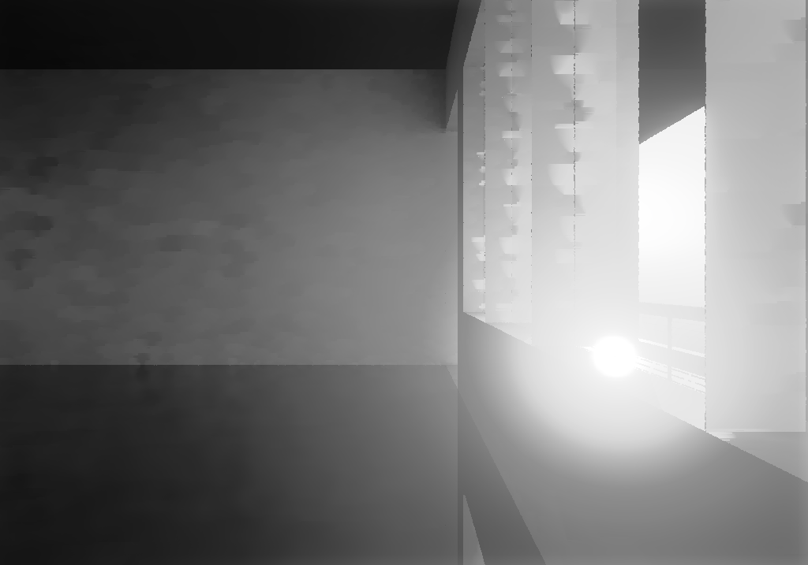
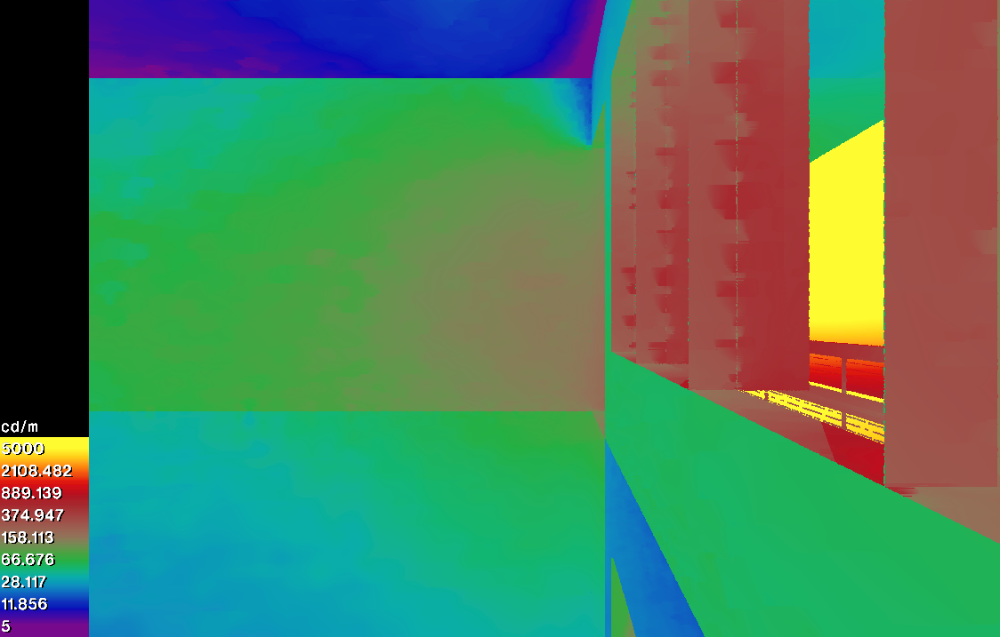
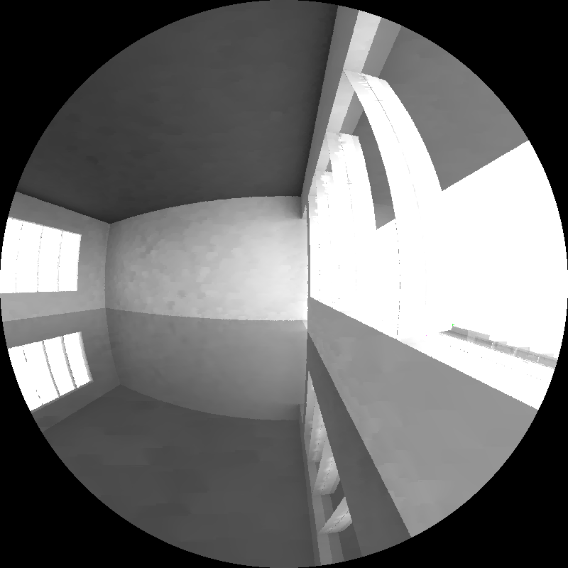

# Introducción

Este documento es **el centro** de la carpeta `simulation_puerta/`. Documenta y ejecuta el proceso completo de validación de la simulación de iluminación natural con **Radiance Two-Phase Method** contra mediciones experimentales con luxómetros.

## Flujo de uso (dos pasos)

El proceso está dividido en dos pasos para separar el cómputo lento del análisis:

```bash
# 1. Pipeline Radiance — corrige los .ill (lento: ~15-20 min con 8 cores).
#    Solo se corre cuando cambian: geometría, materiales, weather, o rejilla.
bash scripts/run_radiance.sh

# 2. Análisis y reporte — carga los .ill y produce el HTML (rápido: ~1 min).
quarto render index.qmd
```

El script `run_radiance.sh` es **idempotente**: si los `.ill` ya existen y son más recientes que sus insumos, los respeta. Para forzar regeneración total:
```bash
rm -rf edificio/{octrees,matrices/dc,results/dc}/*
bash scripts/run_radiance.sh
```

Renderizando este archivo (`quarto render index.qmd`) se obtiene:

1. **Documentación del pipeline Radiance** (qué hace `run_radiance.sh` paso a paso).
2. **Carga y procesamiento** de mediciones experimentales y resultados simulados.
3. **Métricas de validación** según ASHRAE Guideline 14.
4. **Visualizaciones** — mapas de contorno, scatter plots, UDI, DGPs.
5. **Reporte final** en `_output/index.html`.

## Contexto

| Parámetro | Valor |
|-----------|-------|
| Ubicación | Temixco, México (18.85°N, 99.14°W) |
| Edificio | Aula exportada de DesignBuilder |
| Dimensiones del salón | 7.66 m × 9.37 m, plano de trabajo a 0.75 m |
| Mediciones | 26 jun 2024 (verano) y 20 nov 2024 (otoño) |
| Rejilla de sensores | 7 × 9 = 63 puntos, espaciado 1.08 m |
| Resolución temporal | Horaria (8784 timesteps en 2024 bisiesto) |
| Cielo | Reinhart m=1, 146 patches |

## Métricas de validación (ASHRAE Guideline 14)

```
NMBE [%]    = 100 × Σ(exp - sim) / (n × mean(exp))     # |NMBE| ≤ 10
CV(RMSE) [%] = 100 × √(mean((exp - sim)²)) / mean(exp) # ≤ 30
NMAE [%]    = 100 × mean(|exp - sim|) / mean(exp)      # error absoluto medio normalizado
R²          = 1 - SS_res / SS_tot                       # > 0.85
GOF [%]     = √(NMBE² + NMAE²)                          # objetivo: minimizar
```

Convención: **NMBE positivo = simulación subestima** respecto al experimento.

---

# Setup {#sec-setup}

Imports, paths y verificación de que los binarios de Radiance están en el `PATH`.

```{python}
#| label: setup
#| echo: true

import os
import sys
import shutil
import subprocess
from pathlib import Path
from datetime import datetime

import numpy as np
import pandas as pd
import matplotlib.pyplot as plt
import matplotlib.colors as mcolors

# Paths relativos a la raíz del folder (cwd al renderizar)
ROOT = Path.cwd()
EDIFICIO = ROOT / "edificio"
DATA = ROOT / "data"
EXP_DIR = DATA / "experimental"
WEATHER_DIR = DATA / "weather"
SCRIPTS = ROOT / "scripts"

# Carpetas regenerables
OCTREES = EDIFICIO / "octrees"
DC_DIR = EDIFICIO / "matrices" / "dc"
ILL_DIR = EDIFICIO / "results" / "dc"
for d in (OCTREES, DC_DIR, ILL_DIR):
    d.mkdir(parents=True, exist_ok=True)

# Hacer importables los módulos de scripts/lib
sys.path.insert(0, str(SCRIPTS))
from lib.radiance_io import (
    parse_annual_ill_file,
    load_experimental_data,
    load_radiance_data,
)
from lib.metrics import compute_metrics

# Verificar binarios Radiance en PATH
RADIANCE_BINS = ["oconv", "rfluxmtx", "dctimestep", "rmtxop", "gendaymtx", "epw2wea"]
missing = [b for b in RADIANCE_BINS if shutil.which(b) is None]
if missing:
    print(f"FALTAN binarios de Radiance en PATH: {missing}")
else:
    print(f"OK: todos los binarios Radiance disponibles ({', '.join(RADIANCE_BINS)})")

print(f"\nROOT     = {ROOT}")
print(f"EDIFICIO = {EDIFICIO.relative_to(ROOT)}")
print(f"DATA     = {DATA.relative_to(ROOT)}")
```

---

# Insumos del modelo {#sec-insumos}

La escena Radiance se construye a partir de archivos de texto sin compilar. Estos son los **insumos** (no se regeneran, se commitean):

```{python}
#| label: list-inputs
#| echo: false

inputs = {
    "Geometría": [
        "edificio/scene.rad",
        "edificio/objects/scene.geom",
        "edificio/objects/glazing.geom",
    ],
    "Materiales (4 variantes)": [
        f"edificio/materials/{p}" for p in [
            "materials.rad",
            "materials_calibrated.rad",
            "materials_jun_optimal.rad",
            "materials_nov_optimal.rad",
        ]
    ],
    "Cielo": [
        "edificio/skyDomes/skyglow.rad",
    ],
    "Clima": [
        "data/weather/nelier_26jun_20novCST.epw",
    ],
    "Experimentales": [
        "data/experimental/005_26Junio/  (10 archivos: 09h-18h)",
        "data/experimental/006_20Nov/    ( 9 archivos: 09h-17h)",
    ],
}
for cat, files in inputs.items():
    print(f"\n{cat}:")
    for f in files:
        path = ROOT / f.split("  ")[0].rstrip("/")
        marker = "OK" if path.exists() else "MISSING"
        print(f"  [{marker}] {f}")
```

## Variantes de materiales (con puerta)

Geometría: incluye la puerta del salón (`AluminiumIERamarillo`, 1 polígono). Base material desde `scene.mat` de DesignBuilder, con τ corregido a 0.88. Las variantes calibradas vienen del barrido paramétrico (336 combinaciones).

| Variante | Archivo | τ vidrio | ρ piso | ρ pasillo |
|----------|---------|---------:|-------:|----------:|
| Original (DesignBuilder + τ=0.88) | `materials.rad` | 0.88 | 0.65 | 0.36 |
| Calibrado combinado | `materials_calibrated.rad` | 0.80 | 0.19 | 0.13 |
| Óptimo junio | `materials_jun_optimal.rad` | 0.82 | 0.11 | 0.17 |
| Óptimo noviembre | `materials_nov_optimal.rad` | 0.78 | 0.17 | 0.13 |

Las cuatro variantes producen escenas independientes que se simulan por separado y se comparan en la sección de métricas.

---

# Cadena Radiance: cómo se construye una simulación {#sec-radiance}

> **Importante**: este documento **no ejecuta** los pasos pesados de Radiance. Esos viven en `scripts/run_radiance.sh`, que debe correrse **antes** que este reporte. Aquí solo se documentan, se verifica que sus salidas existan, y se cargan para análisis.

## Método Two-Phase (concepto)

El método descompone la simulación anual en factores independientes:

1. **Sky matrix** — describe el cielo de cada hora del año (146 parches Reinhart × 8784 horas).
2. **Daylight Coefficient (DC) matrix** — describe la respuesta del salón a luz que entra por cada parche del cielo. Una matriz por escena.
3. **Multiplicación matricial** — produce la iluminancia anual en cada sensor.

La ventaja: el paso lento (DC matrix) se calcula **una vez por escena**. Cambiar el clima solo requiere recalcular la sky matrix (rápido) y multiplicar.

## Pasos del pipeline (qué hace `run_radiance.sh`)

| # | Paso | Comando | Salida | Tiempo |
|---|------|---------|--------|--------|
| 1 | Rejilla de sensores | `python scripts/generate_sensor_grid.py` | `edificio/points/points_validation.txt` | <1 s |
| 2 | EPW → WEA + sky matrix | `epw2wea` + `gendaymtx -m 1 -O1` | `edificio/skyVectors/nelier_annual.smx` | ~10 s |
| 3a | Octree (×4 variantes) | `oconv mat.rad scene.rad ...` | `edificio/octrees/scene_<v>.oct` | <1 s |
| 3b | DC matrix (×4 variantes) | `rfluxmtx -ab 5 -ad 10000 -lw 0.0001 -n 8` | `edificio/matrices/dc/illum_<v>.mtx` | **~3-5 min/variante** |
| 3c | Iluminancia anual (×4) | `dctimestep \| rmtxop -c 47.4 119.9 11.6` | `edificio/results/dc/annual_<v>.ill` | <5 s |

Donde `<v>` ∈ `{validation, calibrated, jun_optimal, nov_optimal}`.

## Parámetros de `rfluxmtx` (paso lento)

| Flag | Valor | Significado |
|------|-------|-------------|
| `-ab 5` | 5 rebotes ambient | precisión vs tiempo |
| `-ad 10000` | 10000 divisiones | muestreo del hemisferio |
| `-lw 0.0001` | cutoff de peso | descarta rayos muy oscuros |
| `-n 8` | 8 hilos CPU | ajustar a la máquina |
| `-I+` | irradiancia | en lugar de iluminancia directa |
| `-y 63` | 63 sensores | filas del `points_validation.txt` |

## Cómo correrlo

```bash
# Las 4 variantes
bash scripts/run_radiance.sh

# Una sola variante (más rápido para pruebas)
bash scripts/run_radiance.sh validation
```

El script es **idempotente**: respeta archivos existentes que sean más recientes que sus insumos. Para forzar regeneración:
```bash
rm -rf edificio/{octrees,matrices/dc,results/dc}/*
bash scripts/run_radiance.sh
```

## Verificar pre-requisitos

El resto de este documento asume que los `.ill` ya existen. Verificamos:

```{python}
#| label: check-radiance-outputs
#| echo: true

VARIANTS = ["validation", "calibrated", "jun_optimal", "nov_optimal"]

available = []
missing = []
for v in VARIANTS:
    ill = ILL_DIR / f"annual_{v}.ill"
    if ill.exists():
        size = f"{ill.stat().st_size / 1e6:.1f} MB"
        print(f"  [OK]       {ill.relative_to(ROOT)}  ({size})")
        available.append(v)
    else:
        print(f"  [MISSING]  {ill.relative_to(ROOT)}")
        missing.append(v)

# La variante `validation` es la mínima necesaria para los análisis básicos.
if "validation" not in available:
    print(f"\n⚠ Falta la variante MÍNIMA 'validation'.")
    print("  Corre primero:  bash scripts/run_radiance.sh validation")
    raise FileNotFoundError("Missing required variant: validation")

if missing:
    print(f"\n⚠ Variantes faltantes: {missing}")
    print(f"  Las secciones que las usen serán omitidas.")
    print(f"  Para generarlas:  bash scripts/run_radiance.sh {' '.join(missing)}")
else:
    print("\nOK: las 4 variantes están listas para análisis completo.")
```

---

# Rejilla de sensores: visualización {#sec-rejilla}

La rejilla de 7 × 9 = 63 puntos (generada en el paso 1 del pipeline) coincide con las posiciones físicas de los luxómetros del experimento (espaciado 1.08 m, altura plano de trabajo 0.75 m).

```{python}
#| label: fig-sensor-grid
#| fig-cap: "Layout del salón y posiciones de los 63 sensores."
#| echo: false

sensors = np.loadtxt(EDIFICIO / "points" / "points_validation.txt")
sx, sy = sensors[:, 0], sensors[:, 1]

room_min_x, room_max_x = 0.4586, 8.3186
room_min_y, room_max_y = -9.6533, -0.0833

fig, ax = plt.subplots(figsize=(8, 9))
ax.add_patch(plt.Rectangle(
    (room_min_x, room_min_y), room_max_x - room_min_x, room_max_y - room_min_y,
    fill=False, edgecolor='black', linewidth=2,
))
ax.scatter(sx, sy, c='tab:blue', s=30, zorder=3)

ax.text((room_min_x + room_max_x) / 2, room_max_y + 0.3, 'Pared NORTE (ventanas)',
        ha='center', va='bottom', fontsize=10, fontweight='bold')
ax.text((room_min_x + room_max_x) / 2, room_min_y - 0.3, 'Pared SUR (ventanas)',
        ha='center', va='top', fontsize=10, fontweight='bold')
ax.text(room_min_x - 0.3, (room_min_y + room_max_y) / 2, 'ESTE',
        ha='right', va='center', fontsize=10, rotation=90, fontweight='bold')
ax.text(room_max_x + 0.3, (room_min_y + room_max_y) / 2, 'OESTE',
        ha='left', va='center', fontsize=10, rotation=270, fontweight='bold')

ax.set_xlabel("X [m]")
ax.set_ylabel("Y [m]")
ax.set_aspect('equal')
ax.set_title(f"Rejilla de sensores: 7 × 9 = {len(sensors)} puntos a 0.75 m")
ax.grid(alpha=0.3)
plt.tight_layout()
plt.show()
```

---

# Cargar datos experimentales y simulados {#sec-load}

Las funciones `load_experimental_data` y `load_radiance_data` (de `scripts/lib/radiance_io.py`) se encargan de:

- Leer los CSV de luxómetros (klux → lux, exclusión de I5N, inversión de filas en horas impares)
- Parsear los `.ill` de Radiance, extraer las horas pedidas, y reformatear al grid 7×9 mapeado al sistema de columnas del experimento

```{python}
#| label: load-data
#| echo: true

# Horas medidas (común a junio y noviembre — 9 horas en común)
hours = [9, 10, 11, 12, 13, 14, 15, 16, 17]
hour_labels = [f"{h}:00" for h in hours]

# Experimentales
exp_jun = load_experimental_data(EXP_DIR / "005_26Junio", hours)
exp_nov = load_experimental_data(EXP_DIR / "006_20Nov", hours)

# Simulación por variante. Diccionario {variant: {'jun': [...], 'nov': [...]}}
sim = {}
for v in available:
    ill = ILL_DIR / f"annual_{v}.ill"
    sim[v] = {
        'jun': load_radiance_data(ill, 6, 26, hours),
        'nov': load_radiance_data(ill, 11, 20, hours),
    }

print(f"Experimental: {len(exp_jun)} horas (jun), {len(exp_nov)} horas (nov)")
print(f"Variantes simuladas cargadas: {list(sim.keys())}")
print(f"Grid: 7 x 9 = 63 puntos por hora")
```

---

# Métricas ASHRAE G14 — tabla comparativa {#sec-metricas}

Comparación de las variantes disponibles contra las mediciones de **26 jun** y **20 nov**.

```{python}
#| label: metrics-table
#| echo: true

# Etiquetas legibles + parámetros
VARIANT_INFO = {
    'validation':  ('Original',    0.88, 0.65, 0.36),
    'calibrated':  ('Calibrado',   0.80, 0.19, 0.13),
    'jun_optimal': ('Óptimo Jun',  0.82, 0.11, 0.17),
    'nov_optimal': ('Óptimo Nov',  0.78, 0.17, 0.13),
}

rows = []
metrics_by_variant = {}  # cache para usar en cross-validation
for v in available:
    label, tau, rf, rh = VARIANT_INFO[v]
    m_jun = compute_metrics(exp_jun, sim[v]['jun'])
    m_nov = compute_metrics(exp_nov, sim[v]['nov'])
    metrics_by_variant[v] = {'jun': m_jun, 'nov': m_nov}
    rows.append({
        'Variante': label,
        'τ': tau, 'ρ_floor': rf, 'ρ_hall': rh,
        'NMBE_jun [%]':   round(m_jun['nmbe'], 2),
        'CV(RMSE)_jun [%]': round(m_jun['cvrmse'], 2),
        'R²_jun': round(m_jun['r2'], 3),
        'GOF_jun [%]':    round(m_jun['gof'], 2),
        'NMBE_nov [%]':   round(m_nov['nmbe'], 2),
        'CV(RMSE)_nov [%]': round(m_nov['cvrmse'], 2),
        'R²_nov': round(m_nov['r2'], 3),
        'GOF_nov [%]':    round(m_nov['gof'], 2),
    })

df_metrics = pd.DataFrame(rows)
df_metrics
```

**Convenciones:**

- **NMBE positivo** = simulación subestima respecto al experimento.
- **GOF** = √(NMBE² + NMAE²) — métrica a minimizar en calibración.
- **ASHRAE G14**: |NMBE| ≤ 10 %, CV(RMSE) ≤ 30 %, R² > 0.85.

---

# Análisis cross-validation {#sec-crossval}

Estrategia de calibración: optimizar parámetros en un día (calibración) y evaluar en el otro (validación). El día de calibración con menor GOF promedio es el preferido.

```{python}
#| label: cross-validation
#| echo: true

cross_rows = []
for v in available:
    if v == 'validation':
        continue  # solo variantes calibradas
    label, tau, rf, rh = VARIANT_INFO[v]
    if 'jun' in v:
        cal_day, val_day = '26 jun', '20 nov'
        gof_cal = metrics_by_variant[v]['jun']['gof']
        gof_val = metrics_by_variant[v]['nov']['gof']
    elif 'nov' in v:
        cal_day, val_day = '20 nov', '26 jun'
        gof_cal = metrics_by_variant[v]['nov']['gof']
        gof_val = metrics_by_variant[v]['jun']['gof']
    else:
        cal_day, val_day = 'combinado', 'ambos'
        gof_cal = (metrics_by_variant[v]['jun']['gof'] + metrics_by_variant[v]['nov']['gof']) / 2
        gof_val = gof_cal

    cross_rows.append({
        'Día calibración': cal_day,
        'Día validación': val_day,
        'τ': tau, 'ρ_floor': rf, 'ρ_hall': rh,
        'GOF_cal [%]': round(gof_cal, 2),
        'GOF_val [%]': round(gof_val, 2),
        'GOF promedio [%]': round((gof_cal + gof_val) / 2, 2),
        'GOF peor [%]': round(max(gof_cal, gof_val), 2),
    })

df_cross = pd.DataFrame(cross_rows)
df_cross
```

```{python}
#| label: best-calibration
#| echo: true

if cross_rows:
    best = min(cross_rows, key=lambda r: r['GOF promedio [%]'])
    print(f"Mejor calibración (GOF promedio mínimo): {best['Día calibración']}")
    print(f"  Parámetros: τ={best['τ']}, ρ_floor={best['ρ_floor']}, ρ_hall={best['ρ_hall']}")
    print(f"  GOF en {best['Día calibración']} (calibración): {best['GOF_cal [%]']:.2f} %")
    print(f"  GOF en {best['Día validación']} (validación):   {best['GOF_val [%]']:.2f} %")
    print(f"  GOF promedio:                                    {best['GOF promedio [%]']:.2f} %")
```

---

# Mapas de contorno — experimental vs simulado {#sec-contornos}

Comparación visual hora a hora para ambos días de medición.

```{python}
#| label: contour-helper
#| echo: false

# Posiciones físicas para los ejes [m]
distancia_muro_norte = 0.51
distancia_entre_sensores = 1.08
distancia_pizarron = 0.71
distancia_entre_lineas = 1.08

x_pos = [distancia_muro_norte + i * distancia_entre_sensores for i in range(9)]
y_pos = [distancia_pizarron + i * distancia_entre_lineas for i in range(7)]
NIVELES = [0, 300, 500, 1000, 1500, 2000, 3000, 4000, 5000, 6000, 7000, 8000, 10000]
Xg, Yg = np.meshgrid(x_pos, y_pos)


def plot_contour_pair(exp_list, rad_list, title):
    """Plot experimental (top row) vs simulado (bottom row) en grid 6x3."""
    fig, axes = plt.subplots(6, 3, figsize=(16, 22), sharex=True, sharey=True)
    cf = None
    for i, hora in enumerate(hour_labels):
        row_e = (i // 3) * 2
        row_r = (i // 3) * 2 + 1
        col = i % 3

        Z_e = exp_list[i].values.astype(float)
        Z_r = rad_list[i].values.astype(float)

        for ax_, Z in [(axes[row_e, col], Z_e), (axes[row_r, col], Z_r)]:
            cf = ax_.contourf(Xg, Yg, Z, cmap='jet', alpha=0.7, levels=NIVELES)
            c = ax_.contour(Xg, Yg, Z, colors='black', linewidths=0.5, levels=NIVELES)
            ax_.clabel(c, inline=True, fontsize=7)
            ax_.set_xticks(x_pos)
            ax_.set_yticks(y_pos)

        axes[row_e, col].set_title(hora, fontsize=10, fontweight='bold')
        if col == 0:
            axes[row_e, col].set_ylabel('Experimental\n[m]', fontsize=9)
            axes[row_r, col].set_ylabel('Simulado\n[m]', fontsize=9)

    axes[0, 0].invert_yaxis()
    for col in range(3):
        axes[5, col].set_xlabel('[m]')

    cbar_ax = fig.add_axes([0.92, 0.15, 0.02, 0.7])
    fig.colorbar(cf, cax=cbar_ax, label='Iluminancia [lux]')
    fig.suptitle(title, fontsize=13, fontweight='bold', y=0.995)
    plt.tight_layout(rect=[0, 0, 0.91, 0.99])
    plt.show()
```

## Junio 26 — variante óptimo junio

```{python}
#| label: fig-contour-jun
#| fig-cap: "26 jun 2024 — Experimental (filas pares) vs Simulado óptimo junio (filas impares)."

if 'jun_optimal' in sim:
    plot_contour_pair(exp_jun, sim['jun_optimal']['jun'],
                       '26 jun 2024 — Exp vs Simulado (jun_optimal)')
else:
    print("Variante 'jun_optimal' no disponible — corre el pipeline para generarla.")
```

## Noviembre 20 — variante óptimo junio (validación)

```{python}
#| label: fig-contour-nov
#| fig-cap: "20 nov 2024 — Experimental vs Simulado con parámetros óptimos de junio (cross-validation)."

if 'jun_optimal' in sim:
    plot_contour_pair(exp_nov, sim['jun_optimal']['nov'],
                       '20 nov 2024 — Exp vs Simulado (jun_optimal, cross-val)')
else:
    print("Variante 'jun_optimal' no disponible.")
```

---

# Scatter plots {#sec-scatter}

Cada punto es un par (exp, sim) para un sensor en una hora dada. La línea diagonal es la igualdad perfecta.

```{python}
#| label: fig-scatter
#| fig-cap: "Experimental vs simulado para los dos días, usando parámetros óptimos de junio."

if 'jun_optimal' in sim:
    fig, axes = plt.subplots(2, 1, figsize=(8, 16))
    max_val = 12000

    cases = [
        (axes[0], exp_jun, sim['jun_optimal']['jun'], '26 jun 2024', 'Calibración',
         metrics_by_variant['jun_optimal']['jun']),
        (axes[1], exp_nov, sim['jun_optimal']['nov'], '20 nov 2024', 'Validación',
         metrics_by_variant['jun_optimal']['nov']),
    ]
    for ax, exp_list, rad_list, label, role, m in cases:
        all_e = np.concatenate([df.values.flatten() for df in exp_list])
        all_r = np.concatenate([df.values.flatten() for df in rad_list])
        ax.scatter(all_e, all_r, s=6, alpha=0.3, c='steelblue')
        ax.plot([0, max_val], [0, max_val], 'k--', linewidth=1, label='1:1')
        ax.set_xlabel('Experimental [lux]')
        ax.set_ylabel('Simulado [lux]')
        ax.set_title(f"{label} ({role})\n"
                     f"NMBE={m['nmbe']:+.1f}%, CV(RMSE)={m['cvrmse']:.1f}%, "
                     f"R²={m['r2']:.3f}, GOF={m['gof']:.1f}%")
        ax.set_xlim(0, max_val)
        ax.set_ylim(0, max_val)
        ax.set_aspect('equal')
        ax.legend()
        ax.grid(alpha=0.3)
    plt.tight_layout()
    plt.show()
else:
    print("Variante 'jun_optimal' no disponible.")
```

---

# Comparación horaria — promedio espacial {#sec-hourly}

Promedio espacial de los 63 sensores hora a hora, comparando experimento contra cada variante disponible.

```{python}
#| label: fig-hourly-mean
#| fig-cap: "Promedio espacial de iluminancia por hora — experimental vs todas las variantes."

fig, axes = plt.subplots(2, 1, figsize=(10, 12))

colors = {'validation': 'tab:gray',
          'calibrated': 'tab:orange',
          'jun_optimal': 'tab:blue',
          'nov_optimal': 'tab:green'}

for ax, exp_list, day_key, day_label in [
    (axes[0], exp_jun, 'jun', '26 jun 2024'),
    (axes[1], exp_nov, 'nov', '20 nov 2024'),
]:
    exp_means = [df.values.mean() for df in exp_list]
    ax.plot(hours, exp_means, 'ko-', linewidth=2, markersize=6, label='Experimental')

    for v in available:
        rad_means = [df.values.mean() for df in sim[v][day_key]]
        ax.plot(hours, rad_means, 's--', color=colors.get(v, 'tab:purple'),
                linewidth=1.5, markersize=5, label=VARIANT_INFO[v][0], alpha=0.85)

    ax.set_xlabel('Hora')
    ax.set_ylabel('Iluminancia media [lux]')
    ax.set_title(day_label)
    ax.legend(fontsize=9)
    ax.grid(alpha=0.3)
    ax.set_xticks(hours)

plt.tight_layout()
plt.show()
```

---

# Resumen {#sec-resumen}

```{python}
#| label: summary
#| echo: false

print("=" * 70)
print("VALIDACIÓN — RESUMEN")
print("=" * 70)
print()
print(f"  Mediciones:    26 jun 2024 (9 horas) + 20 nov 2024 (9 horas)")
print(f"  Sensores:      63 (rejilla 7 × 9, espaciado 1.08 m, z = 0.75 m)")
print(f"  Variantes:     {len(available)} de 4 disponibles ({', '.join(available)})")
print()
print("Métricas por variante (vs ASHRAE G14: |NMBE| ≤ 10 %, CV(RMSE) ≤ 30 %, R² > 0.85):")
print()
for v in available:
    label, tau, rf, rh = VARIANT_INFO[v]
    m_jun = metrics_by_variant[v]['jun']
    m_nov = metrics_by_variant[v]['nov']
    print(f"  {label}  (τ={tau}, ρ_floor={rf}, ρ_hall={rh})")
    print(f"    Jun 26:  NMBE={m_jun['nmbe']:+6.2f}%  CV(RMSE)={m_jun['cvrmse']:6.2f}%  "
          f"R²={m_jun['r2']:.3f}  GOF={m_jun['gof']:6.2f}%")
    print(f"    Nov 20:  NMBE={m_nov['nmbe']:+6.2f}%  CV(RMSE)={m_nov['cvrmse']:6.2f}%  "
          f"R²={m_nov['r2']:.3f}  GOF={m_nov['gof']:6.2f}%")
    print()

print("Notas:")
print("  - Las simulaciones tienden a sobreestimar la iluminancia (NMBE negativo).")
print("  - Los parámetros calibrados compensan: muebles (ρ_floor↓), marcos+suciedad (τ↓).")
print("  - CV(RMSE) > 30 % indica varianza punto-a-punto alta — esperable en")
print("    salones con variabilidad geométrica no modelada (mobiliario, persianas).")
```

---

# Búsqueda paramétrica {#sec-parametric}

Las 4 variantes anteriores son combinaciones **fijas** de (τ, ρ_floor, ρ_hall). Para encontrar los óptimos sistemáticamente, se realiza una búsqueda en grid sobre el espacio de parámetros.

## Cómo correrla

```bash
# Grid completo (8×7×6 = 336 combinaciones, ~8 h con 8 cores)
uv run python scripts/run_parametric_search.py

# Grid reducido (4×4×4 = 64 combinaciones, ~1.5 h)
uv run python scripts/run_parametric_search.py --quick

# Continuar desde una corrida interrumpida
uv run python scripts/run_parametric_search.py --resume
```

Salidas:

- `data/parametric/grid_results.csv` — todas las combinaciones con NMBE, CV(RMSE), R², GOF para jun y nov
- `data/parametric/optimal_parameters.json` — óptimos por día y combinado

El script es **idempotente** y guarda incrementalmente: si se interrumpe, `--resume` retoma desde donde se quedó.

## Visualización

```{python}
#| label: parametric-load
#| echo: true

PARAM_CSV = ROOT / "data" / "parametric" / "grid_results.csv"
PARAM_JSON = ROOT / "data" / "parametric" / "optimal_parameters.json"

import json

if not PARAM_CSV.exists():
    print(f"No existe {PARAM_CSV.relative_to(ROOT)}.")
    print(f"  Para generar: uv run python scripts/run_parametric_search.py --quick")
    param_df = None
else:
    param_df = pd.read_csv(PARAM_CSV)
    param_df = param_df[param_df.get('success', True) == True].copy()
    print(f"Cargadas {len(param_df)} combinaciones exitosas.")
    if PARAM_JSON.exists():
        optimal = json.loads(PARAM_JSON.read_text())
        print(f"\nÓptimos:")
        for k, v in optimal.items():
            print(f"  {k:18s}  τ={v['tau']:.2f}  ρ_floor={v['rho_floor']:.2f}  ρ_hall={v['rho_hall']:.2f}  "
                  f"GOF_jun={v['gof_jun']:.1f}%  GOF_nov={v['gof_nov']:.1f}%")
```

```{python}
#| label: fig-parametric-heatmap
#| fig-cap: "Heatmaps de GOF en el plano (τ, ρ_floor) para el ρ_hall del óptimo combinado."

if param_df is not None and len(param_df) > 0:
    # Para visualizar, fijamos ρ_hall en el valor del óptimo combinado (o el modal)
    if PARAM_JSON.exists():
        rho_hall_fix = optimal['best_combined']['rho_hall']
    else:
        rho_hall_fix = param_df['rho_hall'].mode().iloc[0]

    sl = param_df[np.isclose(param_df['rho_hall'], rho_hall_fix, atol=1e-3)].copy()

    if len(sl) >= 4:  # mínimo para hacer un heatmap
        fig, axes = plt.subplots(3, 1, figsize=(8, 18))
        for ax, col, title in [
            (axes[0], 'gof_jun',      f'GOF 26 jun [%]'),
            (axes[1], 'gof_nov',      f'GOF 20 nov [%]'),
            (axes[2], 'gof_combined', f'GOF combinado [%]'),
        ]:
            pivot = sl.pivot_table(index='rho_floor', columns='tau', values=col)
            im = ax.imshow(pivot.values, aspect='auto', origin='lower', cmap='viridis_r',
                           extent=[pivot.columns.min(), pivot.columns.max(),
                                   pivot.index.min(), pivot.index.max()])
            ax.set_xlabel('τ (transmitancia vidrio)')
            ax.set_ylabel('ρ_floor')
            ax.set_title(f"{title}  (ρ_hall = {rho_hall_fix:.2f})")
            # marcar mínimo
            min_idx = pivot.values.argmin()
            min_r, min_c = np.unravel_index(min_idx, pivot.shape)
            ax.scatter(pivot.columns[min_c], pivot.index[min_r], marker='*',
                       s=250, c='red', edgecolors='white', linewidths=1.5,
                       label=f'min = {pivot.values.min():.2f}%')
            ax.legend(loc='upper right', fontsize=9)
            fig.colorbar(im, ax=ax, label='GOF [%]')
        plt.tight_layout()
        plt.show()
    else:
        print(f"Solo {len(sl)} puntos con ρ_hall={rho_hall_fix:.2f}; pocos para heatmap.")
else:
    print("(Sin datos paramétricos — corre run_parametric_search.py para generarlos.)")
```

```{python}
#| label: parametric-top10
#| echo: true

if param_df is not None and len(param_df) > 0:
    print("Top 10 por GOF combinado:")
    cols = ['tau', 'rho_floor', 'rho_hall',
            'nmbe_jun', 'cvrmse_jun', 'gof_jun',
            'nmbe_nov', 'cvrmse_nov', 'gof_nov',
            'gof_combined']
    available_cols = [c for c in cols if c in param_df.columns]
    top10 = param_df.nsmallest(10, 'gof_combined')[available_cols].round(2)
    print(top10.to_string(index=False))
else:
    print("(Sin datos)")
```

```{python}
#| label: fig-parametric-sensitivity
#| fig-cap: "Sensibilidad de GOF a cada parámetro: para cada valor del parámetro, GOF mínimo alcanzable variando los otros dos."

if param_df is not None and len(param_df) >= 9:
    fig, axes = plt.subplots(3, 1, figsize=(10, 12))
    for ax, param, label in [
        (axes[0], 'tau', 'τ (transmitancia vidrio)'),
        (axes[1], 'rho_floor', 'ρ_floor (piso aula)'),
        (axes[2], 'rho_hall', 'ρ_hall (piso pasillo)'),
    ]:
        sens = param_df.groupby(param)[['gof_jun', 'gof_nov', 'gof_combined']].min().reset_index()
        ax.plot(sens[param], sens['gof_jun'], 'o-', label='GOF jun', color='tab:orange')
        ax.plot(sens[param], sens['gof_nov'], 's-', label='GOF nov', color='tab:blue')
        ax.plot(sens[param], sens['gof_combined'], '^-', label='GOF combinado', color='tab:green', linewidth=2)
        ax.set_xlabel(label)
        ax.set_ylabel('GOF mínimo [%]')
        ax.legend(fontsize=8)
        ax.grid(alpha=0.3)
    fig.suptitle('Sensibilidad de GOF a cada parámetro (mejor caso variando los otros dos)',
                 fontsize=11, fontweight='bold')
    plt.tight_layout()
    plt.show()
else:
    print("(Sin datos suficientes para análisis de sensibilidad.)")
```

---

# Useful Daylight Illuminance (UDI) — distribución espacial {#sec-udi}

Distribución espacial de los tres bins de UDI sobre el plano de trabajo (rejilla 20×24 = 480 sensores, z=0.75m), durante las horas ocupadas (7:00–18:00) usando la variante **Óptimo 26 jun** (τ=0.82, ρ_floor=0.11, ρ_hall=0.17).

- **UDI_under** (< 300 lux): luz insuficiente
- **UDI_useful** (300–2000 lux): rango útil para tareas visuales
- **UDI_over** (> 2000 lux): exceso, riesgo de deslumbramiento

```{python}
#| label: udi-helpers

ILL_480 = ILL_DIR / "annual_jun_optimal_480.ill"
ILL_DGPS = ILL_DIR / "annual_jun_optimal_dgps.ill"

# Coordenadas del salón (idénticas a antes — geometría con puerta no cambió límites)
room_min_x, room_max_x = 0.4586, 8.3186
room_min_y, room_max_y = -9.6533, -0.0833

# Etiquetas comunes
month_labels = ['Ene', 'Feb', 'Mar', 'Abr', 'May', 'Jun',
                'Jul', 'Ago', 'Sep', 'Oct', 'Nov', 'Dic']


def compute_udi(ill_file, nx=20, ny=24, hour_min=7, hour_max=18):
    """Calcula los bins de UDI a partir del .ill anual sobre la rejilla 480-pt."""
    data = parse_annual_ill_file(ill_file)
    n_hours = data.shape[0]
    occ = np.array([hour_min <= (h % 24) <= hour_max for h in range(n_hours)])
    occ_data = data[occ, :]
    return {
        'under':  ((occ_data < 300).mean(axis=0) * 100).reshape(nx, ny),
        'useful': (((occ_data >= 300) & (occ_data <= 2000)).mean(axis=0) * 100).reshape(nx, ny),
        'over':   ((occ_data > 2000).mean(axis=0) * 100).reshape(nx, ny),
        'n_occupied': int(occ.sum()),
    }
```

```{python}
#| label: fig-udi
#| fig-cap: "UDI espacial: % de horas ocupadas (7-18) en cada bin de iluminancia. La pared sur (Y mínimo) es donde están las ventanas + la puerta."

sensors_480 = np.loadtxt(EDIFICIO / "points" / "points_480.txt")
xs_480 = np.unique(np.round(sensors_480[:, 0], 3))
ys_480 = np.unique(np.round(sensors_480[:, 1], 3))
Y_480_h, X_480_v = np.meshgrid(-ys_480, xs_480)  # Y negado: norte ← sur →

udi = compute_udi(ILL_480)

fig, axes = plt.subplots(3, 1, figsize=(10, 18), sharex=True)
boundaries = [0, 10, 20, 30, 40, 50, 60, 70, 80, 90, 100]
cmap = plt.cm.get_cmap('RdYlGn', len(boundaries) - 1)
norm = mcolors.BoundaryNorm(boundaries, cmap.N)

bins = [
    (r'UDI$_{under}$ (< 300 lux)',   udi['under']),
    (r'UDI$_{useful}$ (300–2000 lux)', udi['useful']),
    (r'UDI$_{over}$ (> 2000 lux)',     udi['over']),
]

cf = None
for i, (ax, (title, grid)) in enumerate(zip(axes, bins)):
    cf = ax.contourf(Y_480_h, X_480_v, grid, levels=boundaries, cmap=cmap, norm=norm)
    cs = ax.contour(Y_480_h, X_480_v, grid, levels=boundaries, colors='black', linewidths=0.5)
    ax.clabel(cs, inline=True, fontsize=9, fmt='%1.0f')
    if i == len(bins) - 1:
        ax.set_xlabel('Y [m] (norte ← → sur, ventanas y puerta)')
    ax.set_ylabel('X [m]')
    ax.set_title(title, fontsize=11, fontweight='bold')
    ax.set_aspect('equal')

cbar_ax = fig.add_axes([0.92, 0.10, 0.013, 0.8])
fig.colorbar(cf, cax=cbar_ax, label='% de horas ocupadas', ticks=boundaries)

fig.suptitle('Useful Daylight Illuminance (UDI) — Óptimo 26 jun (con puerta)\n'
             rf'$\tau$=0.82, $\rho_f$=0.11, $\rho_h$=0.17 — '
             f"{udi['n_occupied']} horas ocupadas (7:00–18:00)",
             fontsize=12, fontweight='bold')
plt.tight_layout(rect=[0, 0, 0.91, 0.95])
plt.show()
```

**Lectura**: el bin `UDI_useful` (panel central) muestra dónde la iluminancia natural cumple el rango útil. Espera ver:
- Zonas cerca de las ventanas (norte y sur) con `UDI_over` alto → demasiada luz por momentos.
- Zonas centrales con `UDI_useful` alto → bien iluminadas.
- La presencia de la puerta en pared sur reduce ligeramente la entrada de luz sur, posiblemente bajando `UDI_over` y subiendo `UDI_useful` cerca de ahí.

---

# Mapa de confort temporal {#sec-confort}

Para cada hora del día y cada mes del año: porcentaje de la **superficie del salón** (los 480 sensores) que está dentro del rango de confort (300–2000 lux). Verde = mayor área en confort.

```{python}
#| label: fig-confort
#| fig-cap: "Mapa de confort temporal: % de área en 300-2000 lux para cada hora y mes (Óptimo 26 jun)."

def compute_temporal_comfort(ill_file, lux_min=300, lux_max=2000,
                             hour_min=7, hour_max=18):
    data = parse_annual_ill_file(ill_file)
    n_hours = data.shape[0]
    year = 2024 if n_hours >= 8784 else 2023

    months = np.zeros(n_hours, dtype=int)
    hours_of_day = np.zeros(n_hours, dtype=int)
    for h in range(n_hours):
        hours_of_day[h] = h % 24
        d = datetime(year, 1, 1) + pd.Timedelta(days=h // 24)
        months[h] = d.month

    in_comfort = ((data >= lux_min) & (data <= lux_max)).mean(axis=1) * 100

    hour_range = list(range(hour_min, hour_max + 1))
    matrix = np.full((len(hour_range), 12), np.nan)
    for mi, month in enumerate(range(1, 13)):
        for hi, hour in enumerate(hour_range):
            mask = (months == month) & (hours_of_day == hour)
            if mask.sum() > 0:
                matrix[hi, mi] = in_comfort[mask].mean()
    return matrix, hour_range


matrix_c, hour_range_c = compute_temporal_comfort(ILL_480)

fig, ax = plt.subplots(figsize=(14, 6))
boundaries = [0, 10, 20, 30, 40, 50, 60, 70, 80, 90, 100]
cmap = plt.cm.get_cmap('RdYlGn', len(boundaries) - 1)
norm = mcolors.BoundaryNorm(boundaries, cmap.N)

im = ax.imshow(matrix_c, aspect='auto', cmap=cmap, norm=norm, origin='lower',
               extent=[-0.5, 11.5, hour_range_c[0] - 0.5, hour_range_c[-1] + 0.5])

ax.set_yticks(hour_range_c)
ax.set_yticklabels([f'{h}:00' for h in hour_range_c])
ax.set_xticks(range(12))
ax.set_xticklabels(month_labels)
ax.set_ylabel('Hora del día')
ax.set_xlabel('Mes')
fig.colorbar(im, ax=ax, label='% de área en 300–2000 lux', ticks=boundaries)
fig.suptitle('Confort lumínico temporal\n% de área en rango útil (300–2000 lux), Óptimo 26 jun (con puerta)',
             fontsize=13, fontweight='bold')
plt.tight_layout(rect=[0, 0, 1, 0.93])
plt.show()
```

**Lectura**: las celdas verdes indican momentos del año con mejor confort lumínico. Mediodía en meses cálidos puede salir naranja/rojo (demasiada luz directa, fuera de rango), mientras que primeras y últimas horas del día pueden tener insuficiente luz natural en invierno.

---

# Daylight Glare Probability simplified (DGPs) {#sec-dgps}

DGPs estima la probabilidad de deslumbramiento desde la **iluminancia vertical** en el ojo del observador. La fórmula simplificada de Wienold:

$$\mathrm{DGPs} = 6.22 \times 10^{-5} \cdot E_v + 0.184$$

| DGPs | Categoría | E_v aprox. [lux] |
|------|-----------|-----------------:|
| ≤ 0.352 | Imperceptible | ≤ 2 700 |
| ≤ 0.394 | Perceptible | ≤ 3 376 |
| ≤ 0.456 | Disturbador (disturbing) | ≤ 4 373 |
| > 0.456 | **Intolerable** | > 4 373 |

Se simulan **40 posiciones de estudiantes sentados** (ojo a 1.20 m), todos mirando hacia el pizarrón en la pared X=8.32. La puerta en la pared sur puede afectar las filas cercanas a esa pared.

## Layout del aula con la puerta

```{python}
#| label: fig-student-layout
#| fig-cap: "Layout de 40 estudiantes (5 filas × 8 columnas), todos mirando al pizarrón. La puerta está en la pared sur."

fig, ax = plt.subplots(figsize=(11, 12))

# Salón
ax.add_patch(plt.Rectangle((room_min_x, room_min_y),
                            room_max_x - room_min_x, room_max_y - room_min_y,
                            linewidth=2, edgecolor='black', facecolor='#f5f5f0'))

# Ventanas: 5 en pared norte, 5 en pared sur
n_windows = 5
win_width = 1.2
win_gap = (room_max_x - room_min_x - n_windows * win_width) / (n_windows + 1)
for i in range(n_windows):
    wx = room_min_x + win_gap * (i + 1) + win_width * i
    ax.plot([wx, wx + win_width], [room_max_y, room_max_y],
            color='dodgerblue', linewidth=6, solid_capstyle='butt')
    ax.plot([wx, wx + win_width], [room_min_y, room_min_y],
            color='dodgerblue', linewidth=6, solid_capstyle='butt')

# Puerta en pared sur
door_x_center = room_min_x + 0.71 + 6 * 1.08
door_width = 0.90
ax.plot([door_x_center - door_width/2, door_x_center + door_width/2],
        [room_min_y, room_min_y],
        color='goldenrod', linewidth=8, solid_capstyle='butt', label='Puerta')
ax.text(door_x_center, room_min_y - 0.4, 'PUERTA', ha='center', va='top',
        fontsize=9, fontweight='bold', color='goldenrod')

# Pizarrón en pared X=room_max_x
bb_y_center = (room_min_y + room_max_y) / 2
bb_half = 2.5
ax.plot([room_max_x, room_max_x], [bb_y_center - bb_half, bb_y_center + bb_half],
        color='darkgreen', linewidth=8, solid_capstyle='butt')
ax.text(room_max_x + 0.18, bb_y_center, 'Pizarrón',
        fontsize=10, ha='left', va='center', color='darkgreen',
        fontweight='bold', rotation=90)

# 40 estudiantes (mismos parámetros que generaron points_dgps.txt)
margin_west, margin_east = 0.7, 2.0
margin_north, margin_south = 0.6, 0.6
ncols, nrows = 8, 5
start_x = room_min_x + margin_west
start_y = room_min_y + margin_south
sp_ew = (room_max_x - room_min_x - margin_west - margin_east) / (nrows - 1)
sp_ns = (room_max_y - room_min_y - margin_north - margin_south) / (ncols - 1)
student_xs = [start_x + r * sp_ew for r in range(nrows)]
student_ys = [start_y + c * sp_ns for c in range(ncols)]

# Posiciones críticas: cerca de ventanas o lejos del pizarrón
critical = {(r, c) for r in range(nrows) for c in range(ncols)
            if c == 0 or c == ncols - 1 or r == 0}

for r, sx in enumerate(student_xs):
    for c, sy in enumerate(student_ys):
        is_crit = (r, c) in critical
        ax.annotate('', xy=(sx + 0.25, sy), xytext=(sx - 0.05, sy),
                    arrowprops=dict(arrowstyle='->', lw=1.0, color='gray'))
        ax.plot(sx, sy, 'o',
                markersize=9 if is_crit else 7,
                color='#e74c3c' if is_crit else '#4a90d9',
                markeredgecolor='#a93226' if is_crit else '#2c5f8a',
                markeredgewidth=0.5)
        ax.text(sx + 0.15, sy + 0.15, f'F{r+1}C{c+1}',
                fontsize=6, color='#333')

# Etiquetas de paredes
ax.text((room_min_x + room_max_x) / 2, room_max_y + 0.4,
        'PARED NORTE (5 ventanas)', ha='center', fontsize=10, fontweight='bold')
ax.text((room_min_x + room_max_x) / 2, room_min_y - 1.2,
        'PARED SUR (5 ventanas + PUERTA)', ha='center', fontsize=10, fontweight='bold')

ax.set_xlim(room_min_x - 1.0, room_max_x + 2.5)
ax.set_ylim(room_min_y - 2.0, room_max_y + 1.0)
ax.set_aspect('equal')
ax.set_xlabel('X [m]')
ax.set_ylabel('Y [m]')
ax.set_title('Layout del aula — 40 estudiantes mirando al pizarrón\n'
             'Rojo = posiciones críticas (cerca de ventanas o lejos del pizarrón)',
             fontsize=12, fontweight='bold')
ax.grid(False)
plt.tight_layout()
plt.show()
```

## DGPs máximo anual por asiento

```{python}
#| label: fig-dgps-spatial
#| fig-cap: "DGPs máximo anual por asiento (horas ocupadas 7–18). Color = peor categoría alcanzada en el año."

dgps_data = parse_annual_ill_file(ILL_DGPS)
dgps_all = 6.22e-5 * dgps_data + 0.184  # E_v lux -> DGPs

# Horas ocupadas (7–18)
n_hours_dgps = dgps_data.shape[0]
occ_mask = np.array([7 <= (h % 24) <= 18 for h in range(n_hours_dgps)])
dgps_occ = dgps_all[occ_mask, :]
ev_occ = dgps_data[occ_mask, :]
total_occ = dgps_occ.shape[0]

# Máximo anual por asiento
annual_max = dgps_occ.max(axis=0)
dgps_grid = annual_max.reshape(nrows, ncols)

student_xs_arr = np.array(student_xs)
student_ys_arr = np.array(student_ys)

fig, ax = plt.subplots(figsize=(12, 8))
for r in range(nrows):
    for c in range(ncols):
        val = dgps_grid[r, c]
        if val > 0.456:
            color = '#e74c3c'  # Intolerable
        elif val > 0.394:
            color = '#e67e22'  # Disturbing
        elif val > 0.352:
            color = '#f1c40f'  # Perceptible
        else:
            color = '#2ecc71'  # Imperceptible
        x = student_xs_arr[r]
        y = student_ys_arr[c]
        rect = plt.Rectangle((x - sp_ew/2.2, y - sp_ns/2.2), sp_ew/1.1, sp_ns/1.1,
                              facecolor=color, edgecolor='gray', linewidth=0.5, alpha=0.75)
        ax.add_patch(rect)
        # Marcar visualmente DGPs alto con borde grueso rojo
        if val > 0.394:
            ax.add_patch(plt.Rectangle((x - sp_ew/2.2, y - sp_ns/2.2),
                                         sp_ew/1.1, sp_ns/1.1,
                                         facecolor='none', edgecolor='red',
                                         linewidth=2.5))
        ax.text(x, y + 0.18, f'{val:.2f}', ha='center', va='center',
                fontsize=9, fontweight='bold')
        ax.text(x, y - 0.18, f'F{r+1}C{c+1}', ha='center', va='center',
                fontsize=7, color='#333')

# Salón
ax.add_patch(plt.Rectangle((room_min_x, room_min_y),
                            room_max_x - room_min_x, room_max_y - room_min_y,
                            linewidth=2, edgecolor='black', facecolor='none'))
# Indicar puerta
ax.plot([door_x_center - door_width/2, door_x_center + door_width/2],
        [room_min_y, room_min_y],
        color='goldenrod', linewidth=8, solid_capstyle='butt')

ax.text((room_min_x + room_max_x) / 2, room_max_y + 0.3,
        'Ventanas norte', ha='center', fontsize=10, color='dodgerblue')
ax.text((room_min_x + room_max_x) / 2, room_min_y - 0.3,
        'Ventanas sur + puerta', ha='center', fontsize=10, color='dodgerblue')
ax.text(room_max_x + 0.35, (room_min_y + room_max_y) / 2,
        'Pizarrón →', ha='left', va='center', fontsize=10,
        color='darkgreen', rotation=90)

from matplotlib.patches import Patch
legend_elements = [
    Patch(facecolor='#2ecc71', edgecolor='gray', label='Imperceptible (≤ 0.352)'),
    Patch(facecolor='#f1c40f', edgecolor='gray', label='Perceptible (≤ 0.394)'),
    Patch(facecolor='#e67e22', edgecolor='gray', label='Disturbador (≤ 0.456)'),
    Patch(facecolor='#e74c3c', edgecolor='gray', label='Intolerable (> 0.456)'),
    Patch(facecolor='none', edgecolor='red', linewidth=2.5,
          label='Borde rojo: DGPs > 0.394 (atención)'),
]
ax.legend(handles=legend_elements, loc='upper left', fontsize=9)

ax.set_xlim(room_min_x - 0.8, room_max_x + 1.0)
ax.set_ylim(room_min_y - 0.8, room_max_y + 0.8)
ax.set_aspect('equal')
ax.set_xlabel('X [m]')
ax.set_ylabel('Y [m]')
ax.set_title('DGPs máximo anual por asiento (horas 7–18) — Óptimo 26 jun con puerta\n'
             'Color = peor categoría alcanzada durante el año',
             fontsize=12, fontweight='bold')
ax.grid(False)
plt.tight_layout()
plt.show()
```

## Top 5 asientos más críticos

```{python}
#| label: dgps-top5

top5_idx = np.argsort(annual_max)[::-1][:5]
rows_t = []
for idx in top5_idx:
    r = idx // ncols
    c = idx % ncols
    x = start_x + r * sp_ew
    y = start_y + c * sp_ns
    h_percep  = int((dgps_occ[:, idx] > 0.352).sum())
    h_disturb = int((dgps_occ[:, idx] > 0.394).sum())
    h_intol   = int((dgps_occ[:, idx] > 0.456).sum())
    rows_t.append({
        'Asiento': f'F{r+1} C{c+1}',
        'X [m]': round(x, 2),
        'Y [m]': round(y, 2),
        'DGPs_max': round(float(annual_max[idx]), 3),
        'E_v_max [lux]': int(ev_occ[:, idx].max()),
        'Perceptible [%]':  round(h_percep / total_occ * 100, 1),
        'Disturbador [%]':  round(h_disturb / total_occ * 100, 1),
        'Intolerable [%]':  round(h_intol / total_occ * 100, 1),
    })

df_dgps_top5 = pd.DataFrame(rows_t)
df_dgps_top5
```

## Mapa temporal de DGPs

Porcentaje de los 40 asientos con deslumbramiento al menos perceptible (DGPs > 0.352) por hora del día y mes del año.

```{python}
#| label: fig-dgps-temporal
#| fig-cap: "Mapa temporal de DGPs: % de los 40 asientos con DGPs > 0.352 (perceptible) por (hora, mes)."

def compute_dgps_temporal(ill_file, dgps_threshold=0.352,
                          hour_min=7, hour_max=18):
    data = parse_annual_ill_file(ill_file)
    n_hours = data.shape[0]
    year = 2024 if n_hours >= 8784 else 2023
    dgps = 6.22e-5 * data + 0.184
    pct_glare = (dgps > dgps_threshold).mean(axis=1) * 100

    months = np.zeros(n_hours, dtype=int)
    hours_of_day = np.zeros(n_hours, dtype=int)
    for h in range(n_hours):
        hours_of_day[h] = h % 24
        d = datetime(year, 1, 1) + pd.Timedelta(days=h // 24)
        months[h] = d.month

    hour_range = list(range(hour_min, hour_max + 1))
    matrix = np.full((len(hour_range), 12), np.nan)
    for mi, month in enumerate(range(1, 13)):
        for hi, hour in enumerate(hour_range):
            mask = (months == month) & (hours_of_day == hour)
            if mask.sum() > 0:
                matrix[hi, mi] = pct_glare[mask].mean()
    return matrix, hour_range


matrix_d, hour_range_d = compute_dgps_temporal(ILL_DGPS)

fig, ax = plt.subplots(figsize=(14, 6))
boundaries = [0, 10, 20, 30, 40, 50, 60, 70, 80, 90, 100]
cmap = plt.cm.get_cmap('RdYlGn_r', len(boundaries) - 1)  # rojo = más glare
norm = mcolors.BoundaryNorm(boundaries, cmap.N)

im = ax.imshow(matrix_d, aspect='auto', cmap=cmap, norm=norm, origin='lower',
               extent=[-0.5, 11.5, hour_range_d[0] - 0.5, hour_range_d[-1] + 0.5])

ax.set_yticks(hour_range_d)
ax.set_yticklabels([f'{h}:00' for h in hour_range_d])
ax.set_xticks(range(12))
ax.set_xticklabels(month_labels)
ax.set_ylabel('Hora del día')
ax.set_xlabel('Mes')
fig.colorbar(im, ax=ax, label='% de los 40 asientos con DGPs > 0.352',
             ticks=boundaries)
fig.suptitle('Mapa temporal de DGPs — Óptimo 26 jun (con puerta)\n'
             '% de los 40 asientos con deslumbramiento perceptible',
             fontsize=13, fontweight='bold')
plt.tight_layout(rect=[0, 0, 1, 0.93])
plt.show()
```

**Lectura**: celdas rojas = momentos del año con muchos asientos en glare. Espera ver picos en mañanas de invierno (sol bajo entrando por ventana sur) y mediodías en general. La puerta en pared sur puede atenuar estos picos para asientos cerca de ella.

## Vista renderizada desde la peor posición {#sec-dgps-render}

Renders desde la posición con DGPs más alto (peor caso del año), generados con `rpict`, `falsecolor` y `evalglare` desde la geometría calibrada con puerta.

**Asiento F2C1** (peor DGPs anual del año), posición `(2.45, −9.05, 1.20)` — cerca de la pared sur (ventanas + puerta).
Momento del pico: **8 de enero 2024 a las 8:00** — DGPs = 0.812 (intolerable), E_v = 10 101 lux.

A esa hora el sol está a 9.5° de altura y −62° de azimut: entra **directo y bajo** por la ventana sur, golpeando al estudiante de costado.

```{python}
#| label: dgps-render-context
#| echo: false
#| output: asis

from pathlib import Path
img_dir = Path("images")
img_persp = img_dir / "dgps_f2c1_jan08_8h_perspective.png"
img_fc    = img_dir / "dgps_f2c1_jan08_8h_falsecolor.png"
img_gl    = img_dir / "dgps_f2c1_jan08_8h_glare.png"

if not all(p.exists() for p in (img_persp, img_fc, img_gl)):
    print(":::{.callout-warning}")
    print("Renders no encontrados. Genera con:")
    print("```bash")
    print("bash scripts/render_dgps_views.sh jun_optimal 2.45 -9.05 1.20 1 8 8 dgps_f2c1_jan08_8h")
    print("```")
    print(":::")
```

::: {layout-ncol=3}

{#fig-dgps-perspective .lightbox}

{#fig-dgps-falsecolor .lightbox}

{#fig-dgps-glare .lightbox}

:::

**Interpretación**:

- **Perspectiva** (izq): el sol entra por la ventana sur (visible como el halo brillante a la derecha). Las ventanas saturadas en blanco confirman luminancia muy alta. El piso se ve oscuro porque el sol llega lateral, casi tangente al plano de trabajo.
- **Falsecolor** (centro): el sol y su entorno inmediato superan **5 000 cd/m²** (rojo/amarillo). Comparar con paredes en zona verde-azul (~50–500 cd/m²) y techo (azul, <50 cd/m²). Esta diferencia de 100× entre fuente (sol) y fondo (paredes) es justamente lo que produce el glare extremo.
- **Fisheye 180°** (der): vista del campo visual completo del estudiante. Las dos ventanas (norte a la izquierda, sur a la derecha) están en su periferia. La sur — donde entra el sol directo — domina el cuadrante derecho. La puerta amarilla en pared sur (ρ=0.68 difusa) interrumpe parcialmente el patrón continuo de ventanas pero no el deslumbramiento del sol directo.

> **Nota**: a las 8:00 del 8 de enero el sol está apenas saliendo (altura solar = 9.5°). Esta combinación de **sol bajo + ángulo lateral** es la peor configuración para glare en este aula — la puerta no logra mitigarla porque el sol está más alto que la altura de la puerta.

